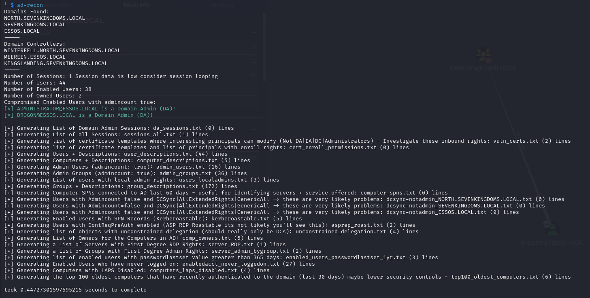

# AD-Recon

Active Directory reconnaissance tool designed to quickly triage Bloodhound data via Neo4j queries.

## Description

This tool automates the cypher queries to the Neo4j database and prints some quick triage data to STDOUT and creates numerous files for further analysis. Each query should be commented in the code above the related code snippet if you'd like to perform any queries on the CLI yourself or within the Neo4j web GUI.

## Getting Started



### Dependencies

Python Neo4j Driver:
https://pypi.org/project/neo4j/

### Installing

Can put the script in any directory. Since it generates numerous files for analysis its best to put it in its own folder for ease of analysis.

You will need to modify the `host`, `user`, and `password` variable at the start of the script to match the authentication required for your instance of Neo4j

```
host = 'localhost'
user = 'neo4j'
password = 'password'
```

This was built and tested on Neo4j version: 4.4.26


### Sample Data
Sample data from GOAD (https://github.com/Orange-Cyberdefense/GOAD) is added to the `sample_data` directory to allow for testing.


### Executing program

* Step-by-step bullets
```
chmod a+x ad-recon.py
~$python ad-recon.py
```

Alternatively you could install it anywhere and symlink to the file to a location in your path:
```
ln -s /home/kali/ad-recon.py /usr/local/bin/ad-recon
```

Optional pathing switch `--pathing` which runs longer queries at the end. It will likely extend the execution time to 10-20mins but you can still go through all the other files while you wait.
Optional transitive switch `--transitive` which runs very long queries to get the effective transitive outbound rights for users and computers - this will often take over 5 hours.
Optional query dumping switch `--dump` which will not perform any queries, but dump each query with an explanation so they can be more easily used in Neo4j/BH for more customization.
Optional more help switch `--morehelp` which will provide explanation tips for analyzing the data provided for each query.

```
usage: ad-recon [-h] [--pathing] [--transitive] [--dump] [--morehelp]

Quickly triage BloodHound data via Neo4j queries

options:
  -h, --help    show this help message and exit
  --pathing     Run pathing queries - takes longer
  --transitive  Run transitive queries - takes even longer
  --dump        Dumps raw Cypher queries to more easily modify and use in BH/Neo4j. If selected no queries are performed
  --morehelp    Provides context into how to analyze the output files

ad-recon --pathing (optional) --dump (optional) --transitive (optional)
                                                            
```

There are also several other auxiliary scripts you can run standalone:
```
- gpo-rights.py (--pathing): This will print out each GPO with the transitive inbound rights. The idea here is to look for non-standard inbound rights (what are the outliers as they may be priv esc paths). If you can control a GPO you can do almost anything to the objects that the GPO applies to.
- adminfalse-hvt-rights.py (default): This will print out High Value Targets (Domain Admins, Domain Controllers, etc.) and any principals that have inbound rights to them this can be very interesting to find escalation paths. You will often seen MSOL_ accounts here and they might be reportable/exploitable.
- cert-temp-enroll-perms.py (default): This will print out all Certificate Templates within the domain and what objects have Enroll or AutoEnroll permissions. The idea here is if you can Enroll to a certificate template it might be exploitable if the template allows for client auth, and ENROLLEE_SUPPLIES_SUBJECT.
- interesting-cert-permissions.py (default): This will print out all certificate templates and who can control them that aren't the standard admins (EAs, DAs, etc.). Investigate the inbound rights as it might be exploitable.
```


## Help


1. Make sure Neo4j is running + has data `neo4j start`
2. Make sure you modified the script to have the right `user`, `password`, and `host` variables set for your environment


## Authors

Andrew McNicol / tides
Luke Hudson / 3z57uff

## Version History

* 0.1
    * Various bug fixes and optimizations
    * See [commit change]() or See [release history]()
* 0.1
    * Initial Release
* 0.2
    * Added in --transitive and --morehelp switches
* 0.3
    * Corrected driver calls to avoid duplicate drivers
